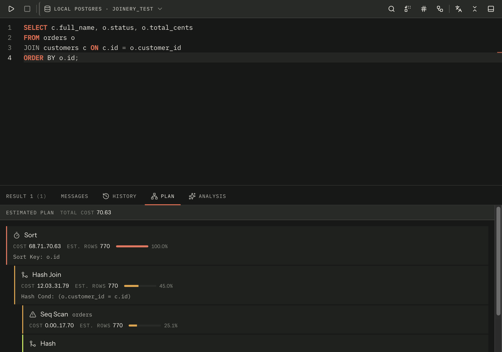

Ask the engine how it intends to run a statement. The query toolbar's plan button does it, and so
does _Show execution plan_ in the [command palette](../command-palette/). The result opens as a
**Plan** tab in the [results panel](../results-grid/) beside the rows.

Like Execute, the plan is taken for **the selection if there is one**, and for whatever
**Execute scope** selects otherwise.

## What each engine can answer, and what it costs

| Engine     | Joinery sends                  | Runs your statement? | Actual row counts? |
| ---------- | ------------------------------ | -------------------- | ------------------ |
| PostgreSQL | `EXPLAIN (FORMAT JSON) …`      | No                   | No                 |
| MySQL      | `EXPLAIN FORMAT=JSON …`        | No                   | No                 |
| SQL Server | `SET STATISTICS PROFILE ON; …` | **Yes**              | Yes                |

> **Careful** — **on SQL Server, asking for a plan runs the statement.** A `SET SHOWPLAN` statement
> may not share a batch with the statement it explains, so the only plan reachable here is the one
> `SET STATISTICS PROFILE` produces — and that is a plan of a statement that has actually executed.
> Asking for the plan of a `DELETE` deletes rows.

Because of that, SQL Server raises a confirmation first, and the confirmation **prints the
statement** (the first three lines, with the rest counted) so you can see what you are consenting
to. There is no "don't ask me again" on it: the consequence is per-statement.

PostgreSQL and MySQL are not gated at all — an `EXPLAIN` there changes nothing. **Settings ▸ Query
▸ Confirm before every execute** is deliberately not consulted for a plan request either: on the
two engines where it would be free there is nothing to consent to, and on SQL Server the stronger
confirmation above already applies.

An estimate-only plan on SQL Server is not available yet.

## Reading the plan

The pane's header says **Estimated plan** or **Actual plan** first, because they are different
claims, then the plan's total cost — and, on PostgreSQL, the planning and execution times when the
server reported them.

Warnings come next, derived from the plan rather than from a fixed list:

- PostgreSQL — a sequential scan over more than 1,000 estimated rows.
- MySQL — a full table scan (`access_type` of `ALL`) over more than 1,000 rows, `Using filesort`,
  and `Using temporary table`. Each is listed once however many nodes carried it.
- SQL Server — any warning the server attached to an operator, and any operator whose actual row
  count came in more than ten times its estimate. That second one is only knowable because the
  statement really ran.

The tree itself is one flat, indented list rather than nested cards, so a deep plan scrolls in one
direction only. Indentation stops at six levels; past that a row states its depth in words.

Each row carries the operator, the object it touches, and whatever the engine reported: cost (as
`startup..total` when both are known), estimated rows, actual rows, how many times the operator
ran, and its time. A bar shows the operator's share of the plan's cost, with a coloured left rule:

| Share of cost | Rule  |
| ------------- | ----- |
| over 50%      | red   |
| over 20%      | amber |
| anything else | green |
| no own cost   | grey  |

On SQL Server the share is taken on the operator's **own** cost — its subtree total minus its
children's — which is what SSMS shows and what you are looking for. The `Cost` figure beside it is
still the subtree total, because that is what the server's column means.

MySQL rows also show the `access_type`, coloured: `ALL` red, `range` and `index` amber, everything
else neutral.

A plan larger than 5,000 operators is truncated rather than allowed to hang the pane.

## When there is no plan

The Plan tab appears only when a plan was parsed for the result currently on screen; a plan from a
previous run is not offered as an answer about this one. A refusal is a message rather than an
empty tree — "the server returned no plan for this statement", or the server's own error.

A plan request goes through the same execution path as any other run, so it is cancellable with
⌘. and **it appears in your [query history](../query-history/)** like anything else. It does not
rename the tab.

Where this page's facts come from

| Claim                                                                                      | Source                                                                                            |
| ------------------------------------------------------------------------------------------ | ------------------------------------------------------------------------------------------------- |
| Reached from the toolbar button and from the palette                                       | `packages/renderer/src/features/query/query-toolbar.tsx:177-192`, `commands/catalogue.ts:644-656` |
| It opens as a Plan tab in the results panel                                                | `packages/renderer/src/features/query/query-results.tsx:366-375, 413-417`                         |
| The selection wins, else Execute scope decides                                             | `packages/renderer/src/features/query/query-panel.tsx:343-359`, `editor/statements.ts:91-97`      |
| The three statements Joinery sends, per engine                                             | `packages/renderer/src/features/query/execution-plan.ts:107-120`                                  |
| Only MSSQL executes; `SET SHOWPLAN_*` cannot share a batch                                 | `packages/renderer/src/features/query/execution-plan.ts:10-33, 83-99`                             |
| SQL Server's confirmation prints the first three lines and counts the rest                 | `packages/renderer/src/features/query/confirm-execute-dialog.tsx:83-89, 121-133, 190-210`         |
| That confirmation offers no "don't ask me again"                                           | `packages/renderer/src/features/query/confirm-execute-dialog.tsx:30-45, 211-224`                  |
| `confirmBeforeExecute` is deliberately not consulted for a plan request                    | `packages/renderer/src/features/query/query-panel.tsx:329-342`                                    |
| An estimate-only MSSQL plan is not implemented                                             | `packages/renderer/src/features/query/execution-plan.ts:31-33`                                    |
| The header states Estimated / Actual, total cost, planning and execution time              | `packages/renderer/src/features/query/execution-plan-view.tsx:216-253`                            |
| PostgreSQL warning: sequential scan over 1,000 estimated rows                              | `packages/renderer/src/features/query/execution-plan.ts:285-294`                                  |
| MySQL warnings: `ALL` over 1,000 rows, filesort, temporary table — de-duplicated           | `packages/renderer/src/features/query/execution-plan.ts:399-412`                                  |
| SQL Server warnings: server warnings, and actual over ten times the estimate               | `packages/renderer/src/features/query/execution-plan.ts:535-555`                                  |
| A flat indented list, capped at six indent steps, with the depth stated past the cap       | `packages/renderer/src/features/query/execution-plan-view.tsx:8-15, 53-60, 110-157`               |
| Row stats: cost (`startup..total`), estimated rows, actual rows, runs, time                | `packages/renderer/src/features/query/execution-plan-view.tsx:161-186`                            |
| Severity thresholds 50% / 20% / above zero / none, and the rule colours                    | `packages/renderer/src/features/query/execution-plan.ts:176-182`, `execution-plan-view.tsx:38-51` |
| MSSQL's share uses the operator's own cost; `cost` stays the subtree total                 | `packages/renderer/src/features/query/execution-plan.ts:556-584`                                  |
| MySQL `access_type` colouring: `ALL` red, `range`/`index` amber                            | `packages/renderer/src/features/query/execution-plan-view.tsx:62-67`                              |
| Plans are truncated at 5,000 nodes                                                         | `packages/renderer/src/features/query/execution-plan.ts:147-155`                                  |
| The Plan tab is matched to the result it belongs to                                        | `packages/renderer/src/features/query/query-results.tsx:122-129`                                  |
| Refusal messages rather than an empty tree                                                 | `packages/renderer/src/features/query/execution-plan.ts:129-145, 426-438`                         |
| A plan request goes through the ordinary execution path, so it is cancellable and recorded | `packages/renderer/src/features/query/query-panel.tsx:284-327`                                    |
| It does not rename the tab                                                                 | `packages/renderer/src/features/query/use-run-query.ts:46-55`, `query-panel.tsx:307`              |

