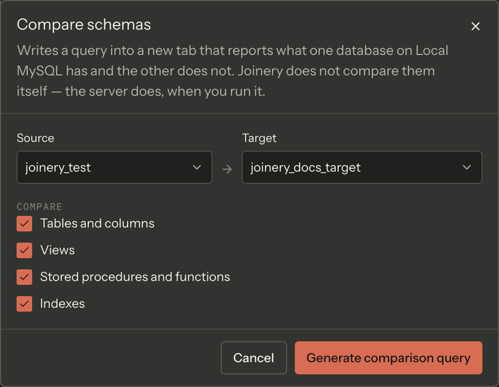

**Compare schemas** writes a query into a new tab. It does not compare anything itself — you run the
query, and the server does the comparing.

That is a deliberate design and the dialog says so out loud: _Joinery does not compare them itself —
the server does, when you run it._ What you get back is a result set, which means it sorts, filters,
copies and exports like any other — none of which a built-in diff view would give you.

## Opening it

| Where                                                | What it pre-fills                        |
| ---------------------------------------------------- | ---------------------------------------- |
| A database's right-click menu ▸ **Compare Schemas…** | That database as the **source**          |
| ⌘K ▸ **Compare database schemas**                    | The focused tab's database as the source |

Both refuse before opening if there is nothing to work with: with no connection you get _Connect to
a server before comparing schemas_, and on a server with fewer than two databases loaded, _… has
only one database loaded — there is nothing to compare it to._

The comparison is always **within one server**. There is no cross-server compare.

## The dialog

Two pickers — **Source** and **Target** — over the databases loaded for that server, and four
checkboxes, all on by default:

- **Tables and columns**
- **Views**
- **Stored procedures and functions**
- **Indexes**

**Generate comparison query** is disabled until the form makes sense, and the reason sits beside the
button rather than being left for you to guess:

| Problem                     | What it says                                                       |
| --------------------------- | ------------------------------------------------------------------ |
| A picker is empty           | _Pick a source and a target database._                             |
| Source and target are equal | _Pick two different databases — a database always matches itself._ |
| Every checkbox is off       | _Choose at least one thing to compare._                            |

Pressing it opens a query tab pointed at the **source** database — that is where the query's
unqualified references resolve — and **does not run it**. Generating SQL rather than a diff is only
worth anything if you can read it before it executes.

## What the query looks like

A header comment naming both databases, then one banner-delimited section per box you ticked, in the
order above. There is deliberately no timestamp in the header, so regenerating the same comparison
produces byte-identical SQL — a saved comparison query does not show as modified just because you
pressed the button again, and two runs can be diffed against each other.

Each section reports what one side has and the other does not, with a `Location` column naming which
database that is. The tables section additionally reports **column differences inside tables both
sides have** — a column missing on one side, or a type or length mismatch.

The SQL is per engine:

- **SQL Server** can name another database inside a query, so the comparison is one statement over
  three-part `INFORMATION_SCHEMA` names, plus `sys.indexes` for the index section. Index names are
  not unique per database in SQL Server, so the index comparison matches on schema and table as well
  as name.
- **MySQL** calls a database a schema and its `information_schema` spans all of them, so the same
  comparison becomes a self-join over two `TABLE_SCHEMA` values, with `information_schema.STATISTICS`
  in place of `sys.indexes`.

Database names are escaped on the way into the SQL — brackets doubled for identifiers, quotes doubled
for literals — so a database called `a]b` or `a'b` still produces a statement that parses.

> **Note** — the routines section covers **functions as well as procedures**, which is why the
> checkbox reads "Stored procedures and functions".

## PostgreSQL

PostgreSQL cannot query across databases, so there is no single statement to generate and Joinery
does not pretend otherwise.

The menu item is still there on a PostgreSQL connection — hiding it would leave someone who read
about the feature hunting for it — and the dialog opens, explains, and offers no Generate button:

> PostgreSQL cannot query across databases, so there is no single statement that compares two of
> them. Connect to each database and compare the results, or install dblink / postgres_fdw.

Comparing two **schemas inside one** PostgreSQL database is a different feature and has not shipped.

Where this page's facts come from

| Claim                                                                        | Source                                                                                                    |
| ---------------------------------------------------------------------------- | --------------------------------------------------------------------------------------------------------- |
| It generates a query and the server does the comparing                       | `packages/renderer/src/features/schema-diff/diff-query.ts:1-8`                                            |
| The dialog's title, description and primary-action wording                   | `packages/renderer/src/features/schema-diff/schema-diff-dialog.tsx:81-86, 174-184`                        |
| A database's menu carries "Compare Schemas…", on every engine                | `packages/renderer/src/shell/sidebar/node-menu.tsx:259-268`                                               |
| That entry pre-selects the clicked database as the source                    | `packages/renderer/src/features/schema-diff/schema-diff-host.tsx:88-91`                                   |
| The palette entry "Compare database schemas" uses the focused tab's database | `packages/renderer/src/commands/catalogue.ts:675-686`, `schema-diff-host.tsx:81-86`                       |
| The two pre-open refusals and their exact wording                            | `packages/renderer/src/features/schema-diff/schema-diff-host.tsx:56-79`                                   |
| The comparison is within one server                                          | `packages/renderer/src/features/schema-diff/schema-diff-dialog.tsx:45-56, 96-99`                          |
| Source and Target pickers over that server's loaded databases                | `packages/renderer/src/features/schema-diff/schema-diff-dialog.tsx:105-135`                               |
| The four sections, their labels and their default-on state                   | `packages/renderer/src/features/schema-diff/diff-query.ts:40-56`                                          |
| The three disabled-reasons, shown beside the button                          | `packages/renderer/src/features/schema-diff/diff-query.ts:87-99`, `schema-diff-dialog.tsx:72-76, 157-166` |
| The tab opens on the source database and does not auto-execute               | `packages/renderer/src/features/schema-diff/schema-diff-host.tsx:102-111`                                 |
| Header comment, banners, and one section per ticked box in a fixed order     | `packages/renderer/src/features/schema-diff/diff-query.ts:101-122`                                        |
| No timestamp, so regeneration is byte-identical                              | `packages/renderer/src/features/schema-diff/diff-query.ts:103-106`                                        |
| Each section reports one-side-only rows with a Location column               | `packages/renderer/src/features/schema-diff/diff-query.ts:148-166, 271-281`                               |
| Column differences are reported for tables both sides have                   | `packages/renderer/src/features/schema-diff/diff-query.ts:168-200, 283-312`                               |
| SQL Server uses three-part names and `sys.indexes`                           | `packages/renderer/src/features/schema-diff/diff-query.ts:19-21, 236-262`                                 |
| The index comparison matches on table and schema as well as index name       | `packages/renderer/src/features/schema-diff/diff-query.ts:143-146, 244-248`                               |
| MySQL uses a `TABLE_SCHEMA` self-join and `information_schema.STATISTICS`    | `packages/renderer/src/features/schema-diff/diff-query.ts:265-268, 336-345`                               |
| Identifiers and literals are escaped                                         | `packages/renderer/src/features/schema-diff/diff-query.ts:348-356`                                        |
| The routines section covers functions as well as procedures                  | `packages/renderer/src/features/schema-diff/diff-query.ts:140-142, 218-234`                               |
| PostgreSQL is refused, and the exact refusal sentence                        | `packages/renderer/src/features/schema-diff/diff-query.ts:75-82, 96`                                      |
| The refusal renders inside the dialog with no Generate button                | `packages/renderer/src/features/schema-diff/schema-diff-dialog.tsx:89-102, 172-185`                       |
| Comparing two schemas in one PostgreSQL database has not shipped             | `packages/renderer/src/features/schema-diff/diff-query.ts:24-27`                                          |

