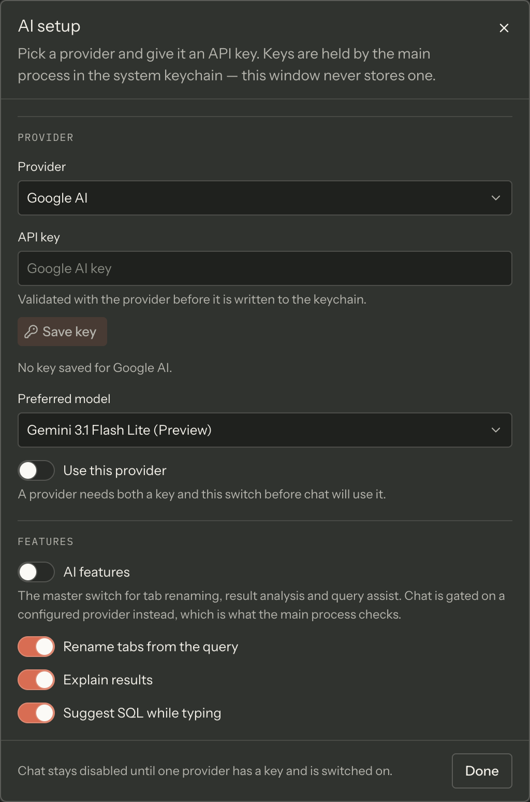

> **Generated page** — every table below is read out of the app's own source when this site is
> built. Do not edit this file by hand: `pnpm run check` and `pnpm run build` regenerate it and fail
> when what is committed here disagrees with the source.

Joinery ships with **6 providers** and **36 models**, in a configuration file the app reads at
startup — version **2.2.0**, last updated **2026-08-18**. The provider picker and the model picker
are built from this list, so neither can offer something the app cannot reach.

Every provider needs an API key of your own. Joinery ships no keys and proxies nothing: the main
process talks to the vendor directly from your machine, with a key you supply.

> **Note** — the key goes to the operating system's credential store, never to a file in the
> profile. [AI setup](../../features/ai-setup/) walks through adding one, and
> [Prerequisites](../../getting-started/prerequisites/#where-credentials-go) says where credentials
> live.

## What the columns mean

| Column         | Meaning                                                                                                                                                                                               |
| -------------- | ----------------------------------------------------------------------------------------------------------------------------------------------------------------------------------------------------- |
| Power rank     | 1–20, higher is more capable. Joinery matches this number when it picks a model for a non-chat AI feature.                                                                                            |
| Cost tier      | The band the configuration files the model under. It is a property of the file, not a price Joinery observes.                                                                                         |
| Context window | Maximum input tokens, as the configuration records them.                                                                                                                                              |
| Max output     | Maximum tokens in one reply, as the configuration records them.                                                                                                                                       |
| Notes          | _Nominated default_ is a flag in the file. _Chat starts here_ is the model a new conversation actually opens on. _Never auto-selected_ marks the routers, whose capability is whatever they route to. |

The two default notes are not the same thing, and most vendors show only the second. **2** of the
**6** nominate a default model in the file. For the rest, a conversation you have not pinned a model
for opens on the **highest-ranked stable model** the vendor offers — preview models lose to a stable
sibling, and routers are not eligible at all. Either way you can pin a preferred model per provider
in AI setup, and override it for a single message in the composer.

The model picker in AI setup lists model names only; the numbers here are what the shipped
configuration records behind them.

## Providers

### Google AI

API base URL: `https://generativelanguage.googleapis.com` · [Get a key](https://aistudio.google.com/app/apikey)

| Model                           | Power rank | Cost tier | Context window | Max output | Notes                               |
| ------------------------------- | ---------- | --------- | -------------- | ---------- | ----------------------------------- |
| Gemini 3.1 Pro (Preview)        | 18         | premium   | 1,048,576      | 65,536     | —                                   |
| Gemini 3.1 Flash Lite (Preview) | 13         | economy   | 1,048,576      | 65,536     | nominated default; chat starts here |
| Gemini 2.5 Pro                  | 16         | premium   | 1,048,576      | 65,536     | —                                   |
| Gemini 2.5 Flash                | 12         | standard  | 1,048,576      | 65,536     | —                                   |
| Gemini 2.5 Flash Lite           | 8          | economy   | 1,048,576      | 65,536     | —                                   |

### Anthropic

API base URL: `https://api.anthropic.com` · [Get a key](https://console.anthropic.com/settings/keys)

| Model             | Power rank | Cost tier | Context window | Max output | Notes            |
| ----------------- | ---------- | --------- | -------------- | ---------- | ---------------- |
| Claude Opus 4.6   | 19         | premium   | 1,000,000      | 128,000    | chat starts here |
| Claude Sonnet 4.6 | 16         | standard  | 1,000,000      | 64,000     | —                |
| Claude Haiku 4.5  | 10         | economy   | 200,000        | 64,000     | —                |

### OpenAI

API base URL: `https://api.openai.com` · [Get a key](https://platform.openai.com/api-keys)

| Model               | Power rank | Cost tier | Context window | Max output | Notes            |
| ------------------- | ---------- | --------- | -------------- | ---------- | ---------------- |
| GPT-5.4             | 19         | premium   | 1,050,000      | 128,000    | chat starts here |
| GPT-5.4 Mini        | 15         | standard  | 400,000        | 128,000    | —                |
| GPT-5.4 Nano        | 11         | economy   | 400,000        | 128,000    | —                |
| GPT-4.1             | 14         | standard  | 1,047,576      | 32,768     | —                |
| GPT-4.1 Mini        | 10         | economy   | 1,047,576      | 32,768     | —                |
| GPT-4.1 Nano        | 7          | economy   | 1,047,576      | 32,768     | —                |
| o3 (Reasoning)      | 18         | premium   | 200,000        | 100,000    | —                |
| o4-mini (Reasoning) | 14         | standard  | 200,000        | 100,000    | —                |
| o3-mini (Reasoning) | 11         | economy   | 200,000        | 100,000    | —                |
| GPT-4o              | 13         | standard  | 128,000        | 16,384     | —                |
| GPT-4o Mini         | 8          | economy   | 128,000        | 16,384     | —                |

### Groq

API base URL: `https://api.groq.com` · [Get a key](https://console.groq.com/keys)

| Model         | Power rank | Cost tier | Context window | Max output | Notes            |
| ------------- | ---------- | --------- | -------------- | ---------- | ---------------- |
| GPT-OSS 120B  | 13         | standard  | 131,072        | 65,536     | chat starts here |
| GPT-OSS 20B   | 8          | economy   | 131,072        | 65,536     | —                |
| Llama 3.3 70B | 10         | standard  | 131,072        | 32,768     | —                |
| Llama 3.1 8B  | 4          | economy   | 131,072        | 131,072    | —                |

### Cerebras

API base URL: `https://api.cerebras.ai` · [Get a key](https://cloud.cerebras.ai/platform)

| Model        | Power rank | Cost tier | Context window | Max output | Notes            |
| ------------ | ---------- | --------- | -------------- | ---------- | ---------------- |
| GPT-OSS 120B | 13         | standard  | 131,072        | 65,536     | chat starts here |
| Llama 3.1 8B | 4          | economy   | 131,072        | 131,072    | —                |

### OpenRouter

API base URL: `https://openrouter.ai/api/v1` · [Get a key](https://openrouter.ai/keys)

| Model                                                             | Power rank | Cost tier | Context window | Max output | Notes                               |
| ----------------------------------------------------------------- | ---------- | --------- | -------------- | ---------- | ----------------------------------- |
| Claude Opus 5                                                     | 19         | premium   | 200,000        | 64,000     | —                                   |
| Claude Sonnet 4.5                                                 | 16         | standard  | 200,000        | 64,000     | nominated default; chat starts here |
| Claude Haiku 4.5                                                  | 10         | economy   | 200,000        | 64,000     | —                                   |
| GPT-5                                                             | 18         | premium   | 400,000        | 128,000    | —                                   |
| GPT-5 Mini                                                        | 14         | standard  | 400,000        | 128,000    | —                                   |
| Gemini 2.5 Flash                                                  | 12         | standard  | 1,048,576      | 65,536     | —                                   |
| Llama 3.3 70B                                                     | 10         | economy   | 131,072        | 32,768     | —                                   |
| Auto Router (Beta)                                                | 17         | premium   | 2,000,000      | 32,768     | never auto-selected                 |
| Auto Router                                                       | 17         | premium   | 2,000,000      | 32,768     | never auto-selected                 |
| Fusion (multi-model panel: ~2-3x slower, panel + analyst pricing) | 18         | premium   | 200,000        | 32,768     | never auto-selected                 |
| Free Models Router                                                | 11         | economy   | 200,000        | 8,192      | never auto-selected                 |

## How this page is generated

`docs-site/scripts/generate-reference.mjs` reads these files and writes this page:

- `packages/shared/src/config/ai-vendors.json`

That is the same file the app loads at startup. The generator asserts its shape before rendering
anything, so a restructured configuration fails the docs build rather than emitting an empty table.

Data digest: `bb66c87c9001` — a fingerprint of exactly the values rendered above. It changes when
what the app ships changes, and not when an unrelated comment in one of those files does.

Regenerate from `docs-site/` with `pnpm run generate:reference`.

Where this page's facts come from

| Claim                                                                                            | Source                                                                                                           |
| ------------------------------------------------------------------------------------------------ | ---------------------------------------------------------------------------------------------------------------- |
| The vendors, models, versions and key links                                                      | `packages/shared/src/config/ai-vendors.json`                                                                     |
| Power rank is 1–20, higher is more capable, and drives automatic model selection                 | `packages/shared/src/types/ai.types.ts:60-82`, `packages/main/src/services/ai/ai-service.ts:337-346`             |
| Router models are excluded from automatic selection because their rank is whatever they route to | `packages/shared/src/types/ai.types.ts:75-81`, `packages/main/src/services/ai/ai-service.ts:335-339`             |
| Chat opens on the nominated default, else the highest-ranked stable auto-selectable model        | `packages/main/src/services/ai/chat-service.ts:35-58`                                                            |
| Four of the six vendors nominate no default, so the fallback is the usual path                   | `packages/shared/src/config/ai-vendors.json`, `packages/main/src/services/ai/chat-service.ts:38-41`              |
| A preferred model can be pinned per provider, and overridden for one message                     | `packages/renderer/src/features/ai-setup/ai-setup-dialog.tsx:315-325`, `features/chat/chat-composer.tsx:272-320` |
| The AI setup dialog lists the vendors and models from this file, showing model names             | `packages/renderer/src/features/ai-setup/ai-setup-dialog.tsx:225-233, 315-325`                                   |
| Keys are held by the OS credential store through `keytar`, per vendor                            | `packages/main/src/services/keychain/credential-store.ts:1-14`, `services/ai/ai-service.ts:136-138`              |

