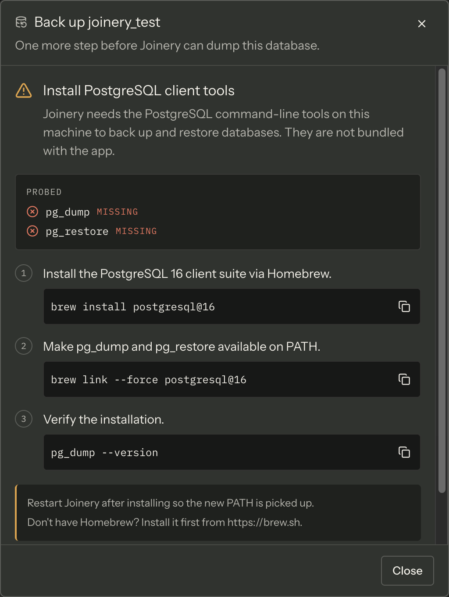

Joinery's backup and restore for **PostgreSQL and MySQL** shell out to the engines' own
command-line tools. They are not bundled with the app, so when they are not on the machine the
wizard replaces its form with a setup view rather than letting you fill in a form that was always
going to fail.

| Engine     | Binaries Joinery looks for |
| ---------- | -------------------------- |
| PostgreSQL | `pg_dump`, `pg_restore`    |
| MySQL      | `mysqldump`, `mysql`       |

SQL Server needs none of this. Its backup and restore are T-SQL statements the server runs, so
the probe is skipped entirely and you will never see this view on an MSSQL connection.

**The install commands are on
[Prerequisites](../../getting-started/prerequisites/#host-cli-tools-for-postgresql-and-mysql-backup-and-restore),
and only there.** The in-app view carries the same steps with copy buttons; this page is about the
cases where following them does not appear to work.

## What the view is telling you

The setup view lists **every tool that was probed**, marks each _found_ or _missing_, and prints
the version string of the ones it found. Read that list before anything else — it is the
difference between "neither tool is installed" and "`pg_dump` is there but `pg_restore` is not",
which is a real and common state after a partial install.

**Re-check** re-probes without closing the dialog. Install in another window, come back, press it.

## A tool you installed is still reported missing

Joinery finds a tool by running `<tool> --version` and seeing whether it exits cleanly. There is
no path configuration and no search of well-known install locations: if the binary is not on the
PATH **of the running app**, it does not exist as far as Joinery is concerned.

Three things make that go wrong:

- **You have not restarted Joinery.** A process inherits its PATH at launch. A shell profile you
  edited afterwards is invisible to an app that was already running. Quit and reopen.
- **The app's PATH is not your shell's PATH — the big one on Apple Silicon.** Homebrew installs to
  `/opt/homebrew`, and `/opt/homebrew/bin` gets onto your PATH through the `brew shellenv` line in
  `~/.zprofile`. An application launched from the Dock or from Finder never runs that file, so on
  an Apple Silicon Mac a Dock-launched Joinery cannot see **anything** installed by Homebrew — not
  the keg-only `mysql-client`, and not `pg_dump` either, however correctly you linked it. Restarting
  does not help, because the restart is also from the Dock.
- **The probe timed out.** Each `--version` call is given five seconds and is killed after that,
  and a killed probe counts as missing. A binary on a slow network volume, or one waiting on
  something, will be reported missing rather than slow.

The answer is also **cached for the lifetime of the app**, per engine. That is why **Re-check**
exists: it is the only thing that bypasses the cache short of restarting.

### Fixing the PATH case

**Start Joinery from a terminal.** A process launched from a shell inherits that shell's
environment, Homebrew's directories included. If the tools are found that way and not otherwise,
the PATH is your whole problem — and this is also the fastest way to keep working today.

To fix it for Dock launches, put Homebrew's directory somewhere the login environment reads
rather than only in an interactive shell profile. Confirm what the app is actually working with
first — `echo $PATH` in your terminal shows the shell's, which is the one that is working; the
app's is the one that is not.

> **Note** — Homebrew's `postgresql@16` is keg-only until you run
> `brew link --force postgresql@16`, and `mysql-client` is keg-only permanently, which is why its
> install needs an explicit PATH line. Both are on the Prerequisites page in full — and both sit
> under `/opt/homebrew` on Apple Silicon, so the case above applies to them regardless.

## "Joinery could not check for the … command-line tools"

This is a different state, and the wizard treats it differently: it **opens the form anyway** and
puts that sentence above the button. The probe itself failed — the request to the main process
rejected — which is not the same as being told the tools are absent. They may well be there, and
the backup is yours to attempt.

If it fails, the failure will be an ordinary spawn error, and the reason is in the output panel
(**⌘J**) — the failed probe is logged there as a warning.

## It is the same probe on both wizards

Restore uses the same check, on the same channel, for the same engines, so a machine that passes
for backup passes for restore. **Re-check** updates the dialog you pressed it in; if the other
wizard is still showing the setup view afterwards, press Re-check there too.

The wizards themselves are documented under
[Backup and restore](../../features/backup-and-restore/).

Where this page's facts come from

| Claim                                                                                         | Source                                                                                                                           |
| --------------------------------------------------------------------------------------------- | -------------------------------------------------------------------------------------------------------------------------------- |
| PG needs `pg_dump` + `pg_restore`; MySQL needs `mysqldump` + `mysql`                          | `packages/main/src/services/sql/cli-deps.ts:32-35`                                                                               |
| The tools are not bundled, and the view exists so the form does not fail with an ENOENT       | `packages/main/src/services/sql/cli-deps.ts:1-16`                                                                                |
| MSSQL skips the probe — the query is disabled when the engine has no CLI                      | `packages/renderer/src/features/backup/backup-dialog.tsx:156-168`                                                                |
| The view lists every probed tool as found or missing, with its version                        | `packages/renderer/src/features/backup/missing-cli-tools.tsx:77-108`                                                             |
| Re-check re-probes without closing the dialog                                                 | `packages/renderer/src/features/backup/missing-cli-tools.tsx:188-198`, `cli-deps.ts:52-65`                                       |
| Presence is decided by `<tool> --version` exiting 0                                           | `packages/main/src/services/sql/cli-deps.ts:73-104`                                                                              |
| A spawn error (ENOENT) counts as not available                                                | `packages/main/src/services/sql/cli-deps.ts:106-110`                                                                             |
| The probe is bounded at five seconds, and a timeout counts as missing                         | `packages/main/src/services/sql/cli-deps.ts:37, 87-91`                                                                           |
| The result is cached per engine for the lifetime of the main process                          | `packages/main/src/services/sql/cli-deps.ts:39-50, 60`                                                                           |
| The probe spawns with the inherited environment; nothing in main sets or extends PATH         | `packages/main/src/services/sql/cli-deps.ts:85` (no `env` argument; no `process.env.PATH` write anywhere in `packages/main/src`) |
| "Restart Joinery after installing so the new PATH is picked up" is the app's own note         | `packages/shared/src/config/cli-install-instructions.ts:38, 65, 90, 118`                                                         |
| `postgresql@16` needs `brew link --force`; `mysql-client` is keg-only and needs a PATH entry  | `packages/shared/src/config/cli-install-instructions.ts:30, 77-82`                                                               |
| Homebrew's own directory on Apple Silicon is `/opt/homebrew` — the app's instructions name it | `packages/shared/src/config/cli-install-instructions.ts:82`                                                                      |
| Missing tools replace the form; a probe that _failed_ opens the form with a note              | `packages/renderer/src/features/backup/backup-model.ts:273-275, 288-303`                                                         |
| The exact "could not check" sentence                                                          | `packages/renderer/src/features/backup/backup-dialog.tsx:177-180`                                                                |
| A failed probe is logged once as a warning                                                    | `packages/renderer/src/features/backup/backup-dialog.tsx:183-187`                                                                |
| Re-check updates the dialog it was pressed in                                                 | `packages/renderer/src/features/backup/backup-dialog.tsx:414-424`                                                                |
| Restore uses the same `backup.checkTools` channel and the same phase machine                  | `packages/renderer/src/features/restore/restore-dialog.tsx:193-198`                                                              |
| ⌘J toggles the output panel                                                                   | `packages/renderer/src/commands/catalogue.ts:559-566`                                                                            |

