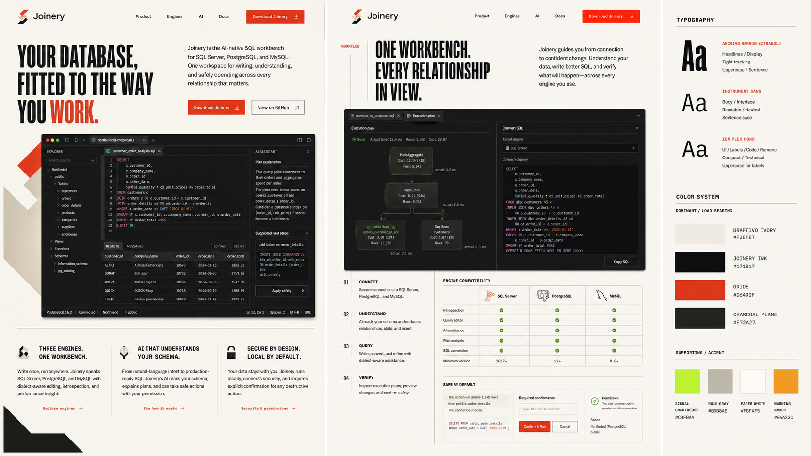

# Joinery brand kit

Joinery is an AI-native relational database workbench for SQL Server, PostgreSQL, and MySQL. The identity combines the precision of a drafting instrument with the craft implied by the name: systems fitted together clearly, deliberately, and safely.

## Source of truth

| Asset                                                        | Purpose                                                                 |
| ------------------------------------------------------------ | ----------------------------------------------------------------------- |
| [`brand-board.png`](./brand-board.png)                       | Art direction, marketing composition, typography, and palette reference |
| [`assets/mark-on-light.svg`](./assets/mark-on-light.svg)     | Standalone mark for ivory, white, and other light surfaces              |
| [`assets/mark-on-dark.svg`](./assets/mark-on-dark.svg)       | Standalone mark for ink and charcoal surfaces                           |
| [`assets/lockup-on-light.svg`](./assets/lockup-on-light.svg) | Horizontal Joinery lockup for light surfaces                            |
| [`assets/lockup-on-dark.svg`](./assets/lockup-on-dark.svg)   | Horizontal Joinery lockup for dark surfaces                             |
| [`tokens.css`](./tokens.css)                                 | Portable CSS brand tokens                                               |
| [`../../resources/icon.svg`](../../resources/icon.svg)       | Canonical app-icon source                                               |

The brand board predates the final logo decision. Its overall art direction is authoritative, but any logo pictured inside the board is superseded by the three-bar stack assets in this directory.

## Logo

The Joinery mark is three descending fitted bars. It carries forward the strongest geometry from the Joinery exploration while belonging to the independent Joinery identity.

- On light backgrounds, use oxide, Joinery ink, and signal chartreuse.
- On dark backgrounds, replace the ink bar with drafting ivory.
- Keep clear space around the mark equal to at least the height of its smallest bar.
- Use the standalone mark no smaller than 20 px on screen. Use the lockup no smaller than 100 px wide.
- Do not rotate the mark, change the bar order, close the gaps, add effects, or introduce alternate colors.

The lockup SVGs contain editable text rather than outlined glyphs. Install Instrument Sans when producing final artwork, or convert the wordmark to outlines in the design tool used for export.

## Color

### Load-bearing palette

| Token          | Hex       | Role                                        |
| -------------- | --------- | ------------------------------------------- |
| Drafting ivory | `#F2EFE7` | Primary light canvas                        |
| Joinery ink    | `#171817` | Primary dark canvas and text                |
| Oxide          | `#D6492F` | Brand action, emphasis, and first logo bar  |
| Charcoal plane | `#272A27` | Raised dark surfaces and restrained borders |

### Supporting palette

| Token             | Hex       | Role                                                |
| ----------------- | --------- | --------------------------------------------------- |
| Signal chartreuse | `#C8F04A` | Verification, success, and rare high-signal moments |
| Rule gray         | `#B9B8AE` | Dividers, drafting lines, and secondary boundaries  |
| Paper white       | `#FBFAF5` | Elevated light surfaces                             |
| Warning amber     | `#E6A23C` | Caution and non-destructive warnings                |

Oxide is the primary accent. Chartreuse should remain scarce so it continues to read as a meaningful signal rather than decoration.

## Typography

| Role                           | Typeface                 | Treatment                                                              |
| ------------------------------ | ------------------------ | ---------------------------------------------------------------------- |
| Display                        | Archivo Narrow ExtraBold | Tight tracking, uppercase or sentence case, compressed editorial scale |
| Interface and body             | Instrument Sans          | Neutral, readable, sentence case                                       |
| Code, labels, and numeric data | IBM Plex Mono            | Compact technical labels; uppercase is acceptable for short metadata   |

Fallbacks are `Arial Narrow` for display, `Inter` for interface text, and `JetBrains Mono` for technical text. Bundle the preferred typefaces before relying on them in production UI.

## Voice

Joinery should sound exact, calm, and competent. Prefer concrete verbs—connect, understand, query, verify—and language about relationships, fit, visibility, and safe operation. Avoid blacksmithing clichés, anthropomorphic AI claims, and vague promises to “revolutionize” database work.

Primary positioning line:

> Your database, fitted to the way you work.

Supporting product sequence:

1. Connect securely.
2. Understand the schema and its relationships.
3. Query with engine-aware context.
4. Verify before anything changes.

## Visual direction

- Use editorial, asymmetric layouts with visible rules and measured spacing.
- Pair warm ivory canvases with dense charcoal product surfaces.
- Treat database relationships as diagrams, rails, and fitted connections.
- Keep corners restrained. Avoid soft, bubbly cards and decorative gradients.
- Product UI should feel operational and information-dense; marketing surfaces may use larger compressed typography and more negative space.

## Asset maintenance

Edit vector sources first, then regenerate raster exports. The packaged application currently consumes:

- `resources/icon.icns` for macOS
- `resources/icon.png` for general packaging
- `packages/renderer/src/favicon.ico` for the renderer shell
- `packages/renderer/src/assets/icons/logo.png` for raster contexts

When the app icon changes, update all four exports together and visually inspect the smallest size.
